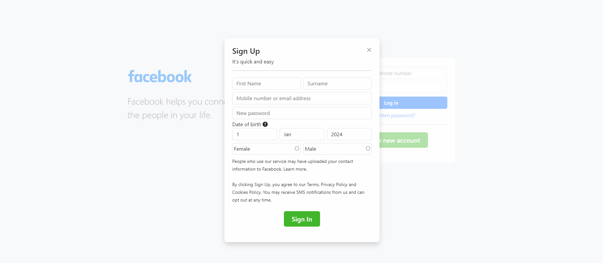
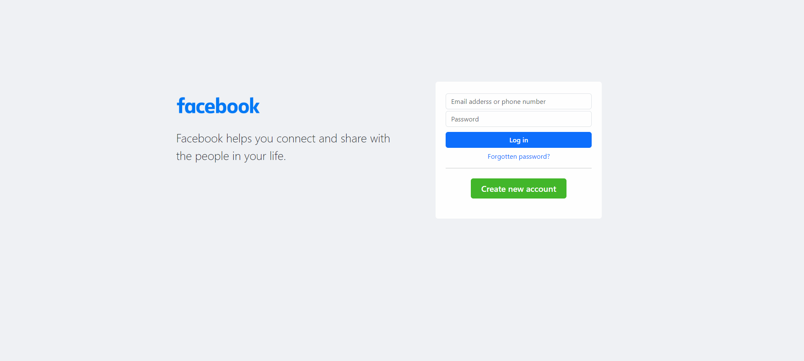

# Facebook Clone

This is a simple Facebook clone created using PHP. It is a basic social networking platform that allows users to create accounts, connect with friends, post updates, and more.

## Features

- **User Authentication:** Users can create accounts, log in, and log out.
- **Profile Management:** Users can edit their profiles, including profile pictures and personal information.
- **Timeline:** Users can post updates on their timelines and see updates from 

## Screenshots

Include screenshots of your application here. You can use the following format:


*Description of the first screenshot.*


*Description of the second screenshot.*

## Installation

1. **Clone the repository:**

    ```bash
    git clone https://github.com/hsuntariq/facebook_php
    ```

2. **Import the database:**

    - Use the provided SQL script to create the necessary tables.

3. **Configure the database connection:**

    - Update the `config.php` file with your database credentials.

4. **Run the application:**

    - Start a local development server and open the project in your web browser.

## Dependencies

- PHP
- MySQL
- Web server (e.g., Apache, Nginx)

## Contributing

Contributions are welcome! If you'd like to contribute, please fork the repository and create a pull request. For major changes, please open an issue first to discuss the changes.

## License

This project is licensed under the MIT License - see the [LICENSE](LICENSE) file for details.

## Acknowledgments

- The project was inspired by the functionality of the Facebook social networking platform.

Feel free to customize this README file according to your specific project details and requirements. Make sure to replace the placeholder information with your actual content.
